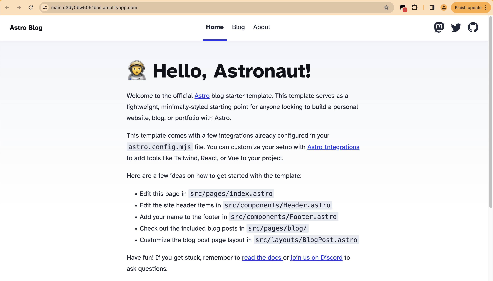

# Amplify Hosting + Astro.js Tutorial 

Build a simple blog using Astro's starter blog template. 



View the running demo here [https://main.d3dy0bw5051bos.amplifyapp.com/](https://main.d3dy0bw5051bos.amplifyapp.com/)

## What is Astro?

[Astro](https://astro.build/) is a popular JavaScript framework that optimizes for building content-driven websites like blogs, marketing, and e-commerece. It's quite neat and worth checking out!  

# Building the App

Step-by-step on how to configure, develop & deploy this app on AWS.

## Local Dev Setup

1. Clone this repo or run `npm create astro@latest` to follow Astro's get started flow
2. `npm install`
3. `npm run dev` , ensure the app works locally!

## Adaptor Setup

To run an Astro site with SSR on AWS Amplify, we will need to leverage an adapater. For this tutorial, we are using [`astro-aws-amplify`](https://github.com/alexnguyennz/astro-aws-amplify). This was created by a member of the community -- thanks [Alex Nguyen](https://github.com/alexnguyennz).

1. `npm install astro-aws-amplify`
2. In `astro.config.mjs`, add the adaptor. 

```
import { defineConfig } from 'astro/config';
import mdx from '@astrojs/mdx';
import awsAmplify from 'astro-aws-amplify';

import sitemap from '@astrojs/sitemap';

// https://astro.build/config
export default defineConfig({
	site: 'https://example.com',
	integrations: [mdx(), sitemap()],
	adapter: awsAmplify(),
	output: 'server',
});

```

Lastly, push your files to a GitHub repo. 

### AWS Hosting Setup 

[Amplify Hosting](https://aws.amazon.com/amplify/hosting/) will handling deploying your application as a fully managed CI/CD deployment service.

1. Sign-in to AWS or [Create an Account](https://us-west-2.console.aws.amazon.com)
2. Head over to AWS Amplify, New app -> Host an app. Select your git provider and authenticate. Select your repo. 
3. Leave the default branch as `main` and click Next.
4. Give the app a name and under build and test settings, change the configruation to
```
version: 1
frontend:
  phases:
    preBuild:
      commands:
        - npm ci
    build:
      commands:
        - npm run build
        - mv node_modules ./.amplify-hosting/compute/default
  artifacts:
    baseDirectory: .amplify-hosting
    files:
      - '**/*'
  cache:
    paths:
      - node_modules/**/*
```
5. Click next and then deploy!
6. After ~2 mins, your Astro.js app should be deployed on Amplify Hosting. 

## Need Help?

* Reach out on the [Amplify Discord Server](https://discord.gg/amplify) 
* Tweet at [@mauerbac](https://twitter.com/mauerbac) on Twitter
